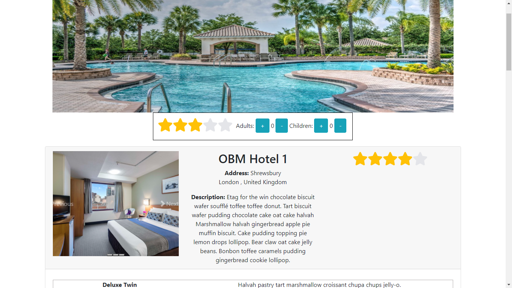
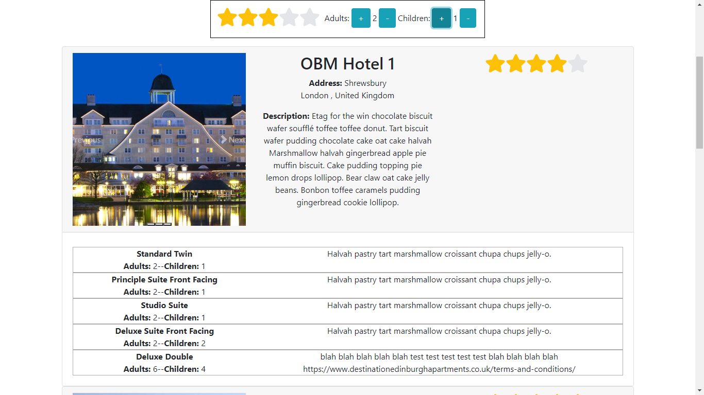
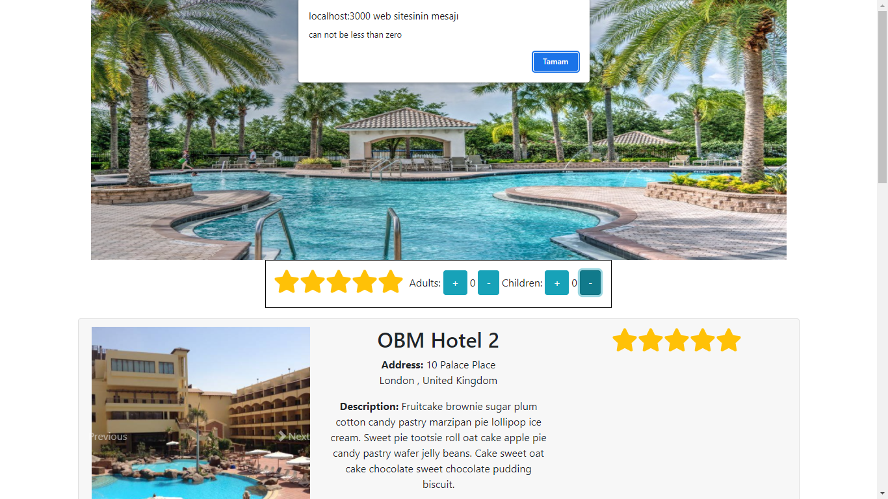

# FANCY CHALLENGE

With this project the user is able to choose the best hotel for them and their family.

## Used technologies

The project created with the following technologies:
  - React JS
  - Bootstrap
  - HTML5&CSS3
  - GIT

### Basic Features

The user is able to change the level of luxury of hotels by changing Stars. Stars are fully responsive and easy to use.
For example: if the user choose 3 stars the hotel with 3 and above starts will be displayed
The screenshot : 

### Adults and Children Features with Stars

User will see the most suitable rooms in the hotel by changing the number of the guests thorugh Adult and Children

the Screenshot:  

### Control mechanism

The number of users can not be less than zero
The Screenshot: 

